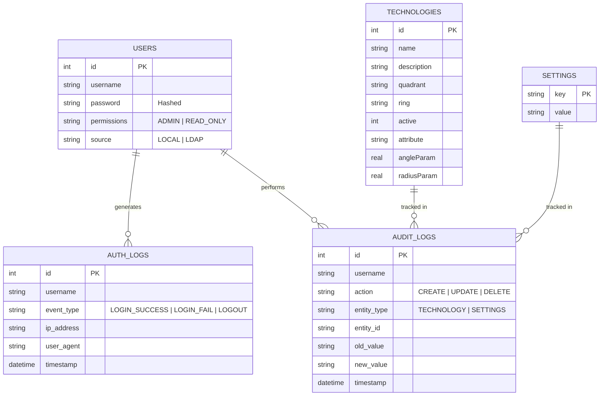
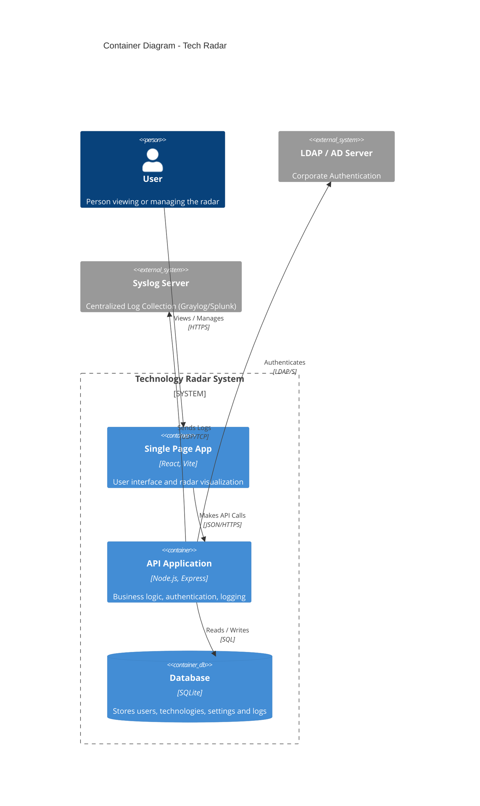
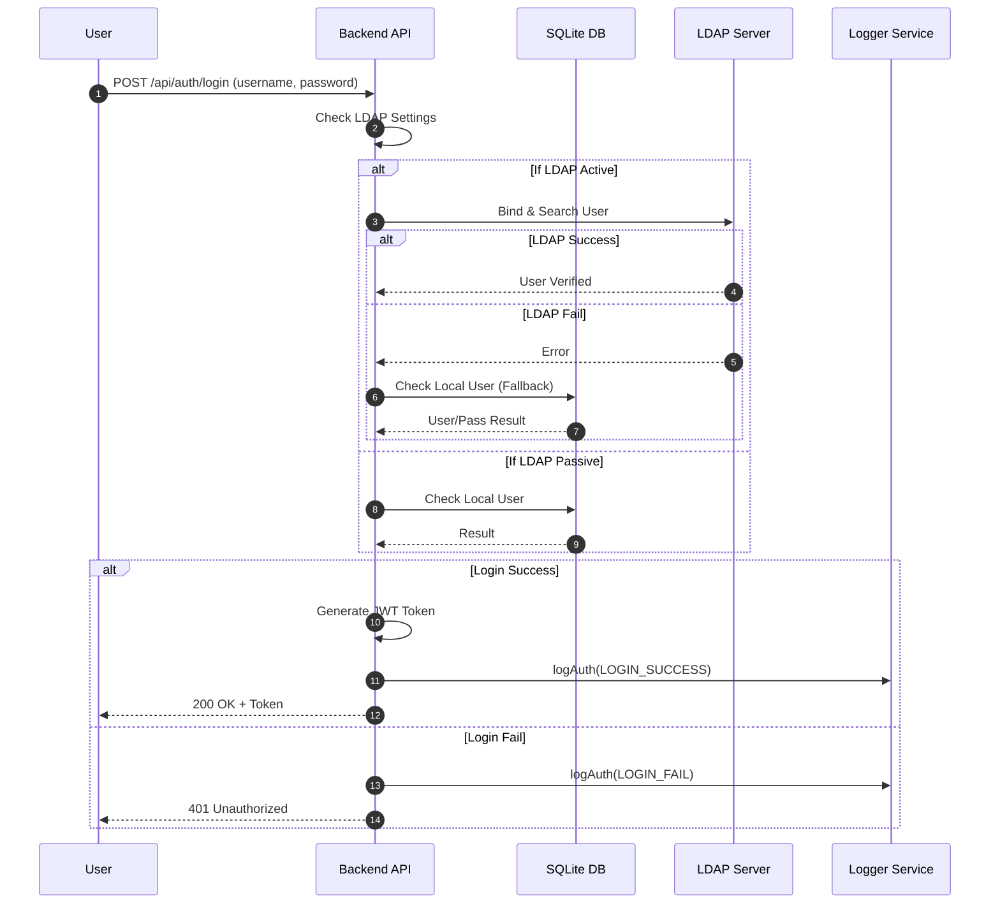
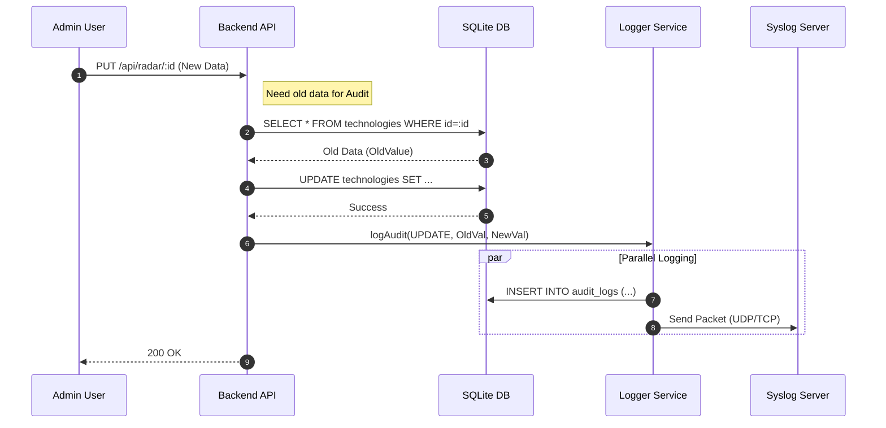
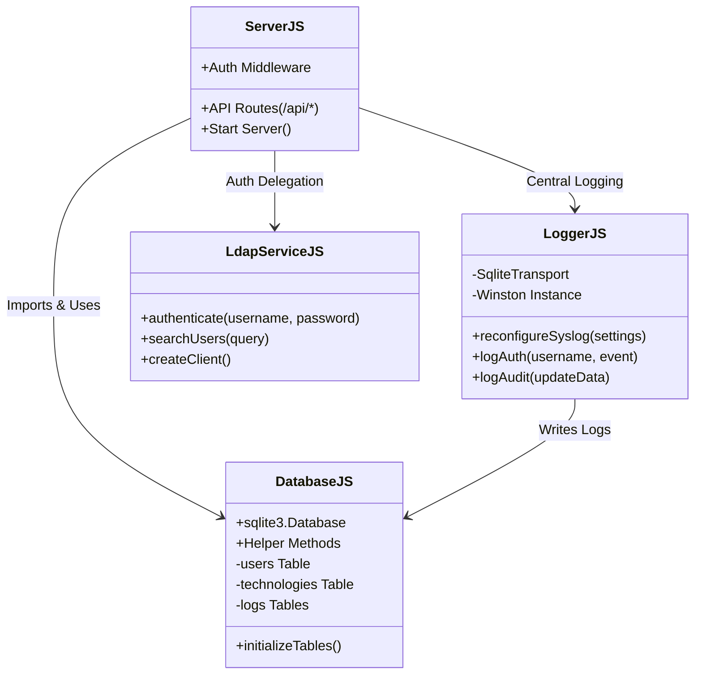

# Architecture and Diagrams

This document visualizes the technical architecture, database structure, and component relationships of the Technology Radar project.

## 1. Database Entity-Relationship Diagram (ERD)

The following diagram shows the tables and schemas in the SQLite database.

## 2. C4 Container Diagram (System Architecture)

This diagram shows the high-level components of the system and interactions with external systems.

## 3. Sequence Diagrams

This section shows how critical processes work step-by-step.

### 3.1. Authentication (Login) Flow

The system's decision mechanism when a user attempts to log in:

### 3.2. Data Update and Audit Log Flow

The "Audit" and "Syslog" process that occurs when a technology is updated:

## 4. Backend Module Diagram (Class Diagram)

This diagram shows the logical separation of the backend code and dependencies between modules.

### Module Relationship Explanation

*   **ServerJS:** The brain and gateway of the application.
    *   `+`: Indicates public properties. E.g., defines API routes (`/api/*`) and starts the server (`Start Server`).
*   **DatabaseJS:** The memory center.
    *   Establishes the database connection (`sqlite3.Database`).
    *   Creates tables if they don't exist via `initializeTables()`.
    *   `-`: Indicates private structure. The tables themselves (`users`, `technologies`) are under this module's management.
*   **LoggerJS:** The record keeper.
    *   `logAuth` and `logAudit` functions are open for use by other modules.
    *   It uses a custom `SqliteTransport` (its own database driver) and the Winston library in the background.
*   **LdapServiceJS:** The external relations expert.
    *   Only handles user/password authentication (`authenticate`) and search (`searchUsers`) tasks.

**Arrows (Relationships):**
*   **ServerJS --> Others:** Server.js is the top-level manager; it imports and uses Database, Logger, and LDAP services.
*   **LoggerJS --> DatabaseJS:** This is an interesting detail; The Logging service relies on the Database module to write logs. Meaning Logger does not work alone, it depends on the database.
