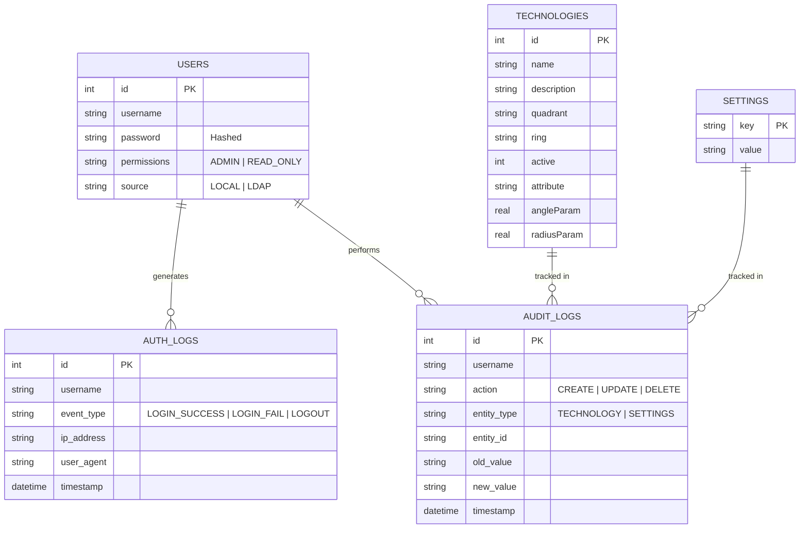
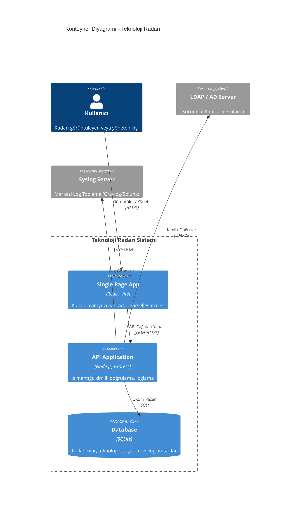
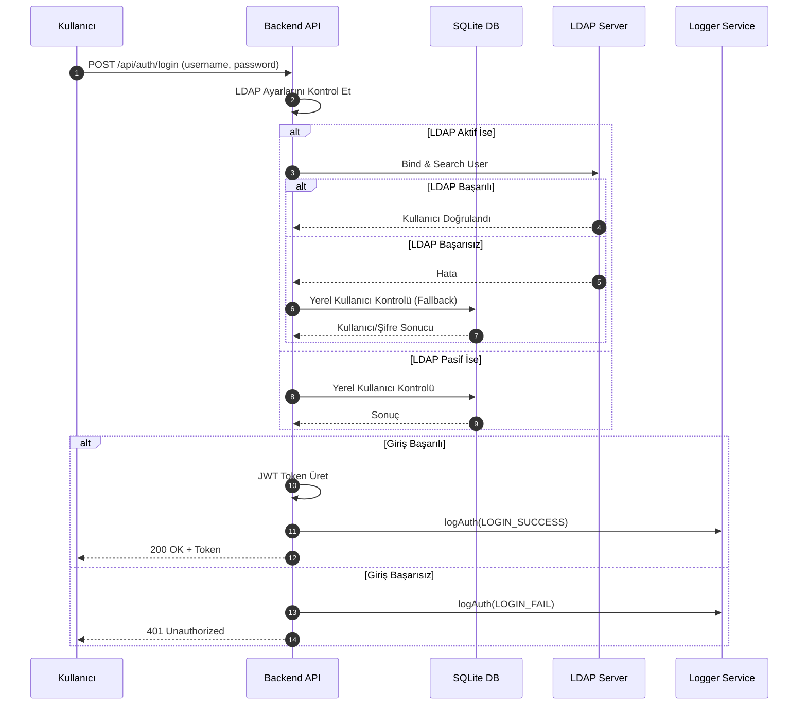
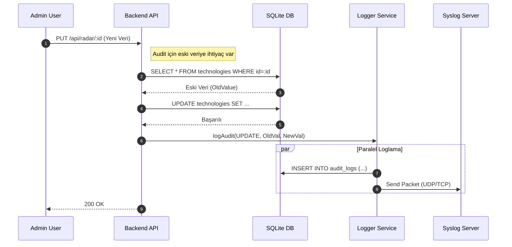
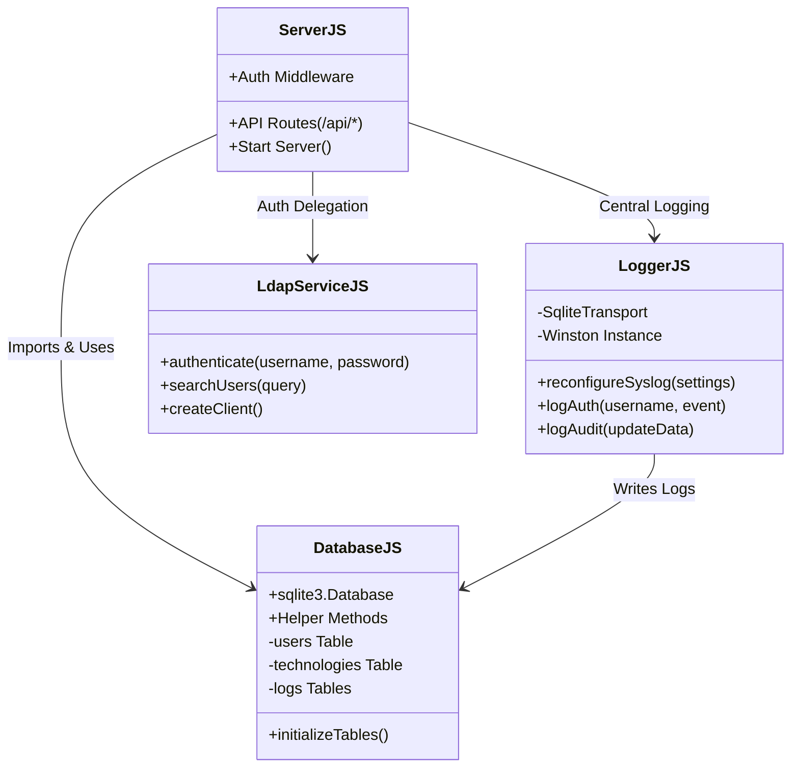

# Mimari ve Diyagramlar

Bu doküman, Teknoloji Radarı projesinin teknik mimarisini, veritabanı yapısını ve bileşenler arası ilişkileri görselleştirmektedir.

## 1. Veritabanı Varlık-İlişki Diyagramı (ERD)

Aşağıdaki diyagram, SQLite veritabanındaki tabloları ve şemalarını göstermektedir.

## 2. C4 Konteyner Diyagramı (Sistem Mimarisi)

Bu diyagram, sistemin üst düzey bileşenlerini ve dış sistemlerle olan etkileşimlerini gösterir.

## 3. Akış (Sequence) Diyagramları

Bu bölüm, sistemdeki kritik süreçlerin adım adım nasıl işlediğini gösterir.

### 3.1. Kimlik Doğrulama (Login) Akışı

Kullanıcı giriş yapmaya çalıştığında sistemin karar mekanizması:

### 3.2. Veri Güncelleme ve Audit Log Akışı

Bir teknoloji güncellendiğinde gerçekleşen "Audit" ve "Syslog" süreci:

## 4. Backend Modül Diyagramı (Class Diagram)

Bu diyagram, backend kodunun mantıksal ayrımını ve modüller arası bağımlılıkları gösterir.

### Modül İlişkileri Açıklaması

*   **ServerJS:** Uygulamanın beyni ve giriş kapısıdır.
    *   `+`: Dışarıya açık özellikleri gösterir. Örn: API rotalarını (`/api/*`) tanımlar ve sunucuyu başlatır (`Start Server`).
*   **DatabaseJS:** Hafıza merkezidir.
    *   Veritabanı bağlantısını kurar (`sqlite3.Database`).
    *   `initializeTables()` ile tablolar yoksa oluşturur.
    *   `-`: Gizli/private yapıyı gösterir. Tabloların kendisi (`users`, `technologies`) bu modülün yönetimi altındadır.
*   **LoggerJS:** Kayıt tutucudur.
    *   `logAuth` ve `logAudit` fonksiyonları diğer modüllerin kullanımına açıktır.
    *   Arka planda özel bir `SqliteTransport` (kendi veritabanı sürücüsü) ve Winston kütüphanesini kullanır.
*   **LdapServiceJS:** Dış ilişkiler uzmanıdır.
    *   Sadece kullanıcı adı/şifre doğrulama (`authenticate`) ve arama (`searchUsers`) işlerini yapar.

**Oklar (İlişkiler):**
*   **ServerJS --> Diğerleri:** Server.js en tepedeki yöneticidir; Database, Logger ve LDAP servislerinin hepsini içe aktarır (import) ve kullanır.
*   **LoggerJS --> DatabaseJS:** Bu ilginç bir detaydır; Loglama servisi de logları yazmak için Database modülünü kullanır. Yani Logger tek başına çalışmaz, veritabanına bağımlıdır.

